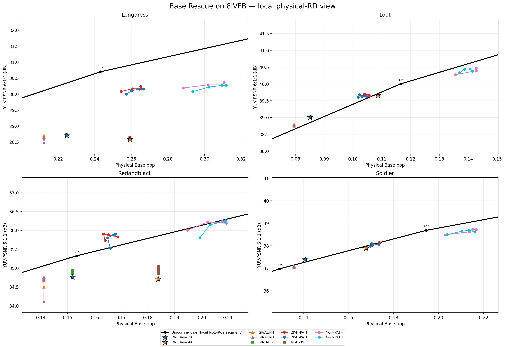
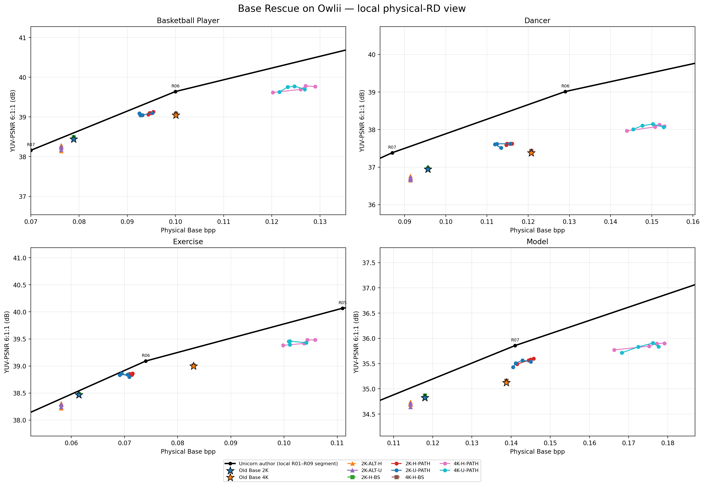

# Base Rescue Final Screening Report

## Scope and provenance

- Primary decision evidence: per-sequence 8iVFB and Owlii physical hard Base evaluation.
- RWTT-28Lite is retained only as an in-distribution sanity diagnostic.
- Base payload is exactly `x_low + r1 + r2 + r3 + r4`; native `r5=0`; every included row passed bit identity.
- Rescue training source: `5087bb8372c92aee886747f989f31d86a40e8f05`; H-PATH memory-hygiene execution source: `0719a1674289e3a9357a70270260f2e4cdd2ece8`.
- Official overlays use retained, previously audited author-provided per-sequence R01–R09 CSVs. Interpolation is local only; out-of-range candidates are `N/A`.
- `U-PATH`: Uniform sampling, Prefix + BaseSynthesis trainable. `H-PATH`: high-energy sampling, Prefix + BaseSynthesis trainable. `H-BS`: high-energy sampling, BaseSynthesis-only (`BS` does not mean batch size). `ALT-U/H`: alternative 2k128 family with Uniform/high-energy sampling.

## 1. Training completion

| arm | status | steps | runtime_min | peak_VRAM_GiB | reload | r_stages | native_r5 |
| --- | --- | --- | --- | --- | --- | --- | --- |
| 2K-ALT-H | PASS | 3525 | 53.3631 | 5.2207 | True | 4 | False |
| 2K-ALT-U | PASS | 3525 | 51.9377 | 5.1490 | True | 4 | False |
| 2K-H-BS | PASS | 1500 | 23.6228 | 5.1315 | True | 4 | False |
| 2K-H-PATH | PASS | 1500 | 52.6854 | 8.5372 | True | 4 | False |
| 2K-U-PATH | PASS | 1500 | 44.3444 | 12.0345 | True | 4 | False |
| 4K-H-BS | PASS | 1500 | 23.6242 | 5.1315 | True | 4 | False |
| 4K-H-PATH | PASS | 1500 | 52.6546 | 8.5372 | True | 4 | False |
| 4K-U-PATH | PASS | 1500 | 44.3415 | 12.0345 | True | 4 | False |

The two H-PATH jobs completed 1500 steps with `BS=4` and `empty_cache_every=1`; this demonstrates successful memory-hygiene mitigation, not a strict proof that fragmentation was the sole original OOM cause.

## 2. RWTT-28Lite sanity

| arm | step | bpp | Y | U | V | YUV611 | bit_identity |
| --- | --- | --- | --- | --- | --- | --- | --- |
| 2K-ALT-H | 500 | 0.1418 | 29.9598 | 42.3950 | 43.1128 | 33.1583 | True |
| 2K-ALT-H | 1000 | 0.1418 | 30.0158 | 42.4779 | 43.1740 | 33.2183 | True |
| 2K-ALT-H | 2000 | 0.1418 | 30.0079 | 42.4959 | 43.1996 | 33.2179 | True |
| 2K-ALT-H | 3525 | 0.1418 | 30.0394 | 42.5299 | 43.2609 | 33.2534 | True |
| 2K-ALT-U | 500 | 0.1418 | 29.9641 | 42.4031 | 43.1139 | 33.1627 | True |
| 2K-ALT-U | 1000 | 0.1418 | 30.0030 | 42.3911 | 43.1148 | 33.1904 | True |
| 2K-ALT-U | 2000 | 0.1418 | 30.0117 | 42.3774 | 43.1519 | 33.1999 | True |
| 2K-ALT-U | 3525 | 0.1418 | 30.0134 | 42.4389 | 43.2286 | 33.2185 | True |
| 2K-H-BS | 250 | 0.1480 | 30.1250 | 42.8957 | 43.9240 | 33.4462 | True |
| 2K-H-BS | 500 | 0.1480 | 30.1280 | 42.9105 | 43.9085 | 33.4483 | True |
| 2K-H-BS | 1000 | 0.1480 | 30.1286 | 42.9546 | 43.9249 | 33.4564 | True |
| 2K-H-BS | 1500 | 0.1480 | 30.1286 | 42.9429 | 43.9521 | 33.4583 | True |
| 2K-U-PATH | 250 | 0.1716 | 30.5094 | 43.1697 | 43.8207 | 33.7559 | True |
| 2K-U-PATH | 500 | 0.1734 | 30.5442 | 43.3014 | 43.9895 | 33.8195 | True |
| 2K-U-PATH | 1000 | 0.1747 | 30.5552 | 43.2959 | 43.9677 | 33.8243 | True |
| 2K-U-PATH | 1500 | 0.1774 | 30.5536 | 43.1890 | 44.0112 | 33.8152 | True |
| 4K-H-BS | 250 | 0.1762 | 30.4000 | 43.1316 | 44.2851 | 33.7271 | True |
| 4K-H-BS | 500 | 0.1762 | 30.4055 | 43.1780 | 44.2875 | 33.7373 | True |
| 4K-H-BS | 1000 | 0.1762 | 30.4034 | 43.2018 | 44.3235 | 33.7432 | True |
| 4K-H-BS | 1500 | 0.1762 | 30.4072 | 43.1921 | 44.3366 | 33.7465 | True |
| 4K-U-PATH | 250 | 0.2050 | 30.8258 | 43.4959 | 44.1874 | 34.0798 | True |
| 4K-U-PATH | 500 | 0.2112 | 30.8904 | 43.6492 | 44.2990 | 34.1613 | True |
| 4K-U-PATH | 1000 | 0.2153 | 30.9127 | 43.7522 | 44.3186 | 34.1934 | True |
| 4K-U-PATH | 1500 | 0.2177 | 30.8746 | 43.5202 | 44.3574 | 34.1406 | True |

## 3. External group summaries (means are secondary)

Per-sequence evidence in the next section remains authoritative; these means are navigation aids only.

The columns `delta_bpp` and `delta_baseline` are descriptive coordinate changes only and **must not be used separately to rank models**. The RD decision variable is:

```text
delta_to_official_curve
= candidate YUV611 - author-curve interpolation at candidate physical bpp

rd_rescue_gain_vs_baseline
= candidate delta_to_official_curve - old-Base delta_to_official_curve
```

Thus, `rd_rescue_gain_vs_baseline > 0` means that the candidate moved closer to (or farther above) the author RD curve after accounting for its changed bitrate. It does not require the candidate to exceed the author curve.

| dataset | arm | step | bpp | YUV611 | delta_bpp | delta_baseline | delta_official | sequences_improved | bit_identity |
| --- | --- | --- | --- | --- | --- | --- | --- | --- | --- |
| 8ivfb | 2K-ALT-H | 500 | 0.1422 | 34.7128 | -0.0084 | -0.2533 | -0.5272 | 0 | True |
| 8ivfb | 2K-ALT-H | 1000 | 0.1422 | 34.7589 | -0.0084 | -0.2071 | -0.4810 | 0 | True |
| 8ivfb | 2K-ALT-H | 2000 | 0.1422 | 34.7891 | -0.0084 | -0.1770 | -0.4509 | 0 | True |
| 8ivfb | 2K-ALT-H | 3525 | 0.1422 | 34.8417 | -0.0084 | -0.1244 | -0.3983 | 1 | True |
| 8ivfb | 2K-ALT-U | 500 | 0.1422 | 34.6038 | -0.0084 | -0.3623 | -0.6362 | 0 | True |
| 8ivfb | 2K-ALT-U | 1000 | 0.1422 | 34.7925 | -0.0084 | -0.1736 | -0.4475 | 0 | True |
| 8ivfb | 2K-ALT-U | 2000 | 0.1422 | 34.8106 | -0.0084 | -0.1555 | -0.4294 | 0 | True |
| 8ivfb | 2K-ALT-U | 3525 | 0.1422 | 34.8108 | -0.0084 | -0.1553 | -0.4292 | 0 | True |
| 8ivfb | 2K-H-BS | 250 | 0.1506 | 34.9898 | 0.0000 | 0.0237 | -0.4511 | 2 | True |
| 8ivfb | 2K-H-BS | 500 | 0.1506 | 35.0177 | 0.0000 | 0.0516 | -0.4232 | 3 | True |
| 8ivfb | 2K-H-BS | 1000 | 0.1506 | 35.0147 | 0.0000 | 0.0486 | -0.4262 | 4 | True |
| 8ivfb | 2K-H-BS | 1500 | 0.1506 | 35.0204 | 0.0000 | 0.0543 | -0.4205 | 4 | True |
| 8ivfb | 2K-H-PATH | 250 | 0.1737 | 35.8644 | 0.0230 | 0.8983 | -0.1372 | 4 | True |
| 8ivfb | 2K-H-PATH | 500 | 0.1758 | 35.9601 | 0.0252 | 0.9941 | -0.0785 | 4 | True |
| 8ivfb | 2K-H-PATH | 1000 | 0.1780 | 35.9594 | 0.0274 | 0.9933 | -0.1043 | 4 | True |
| 8ivfb | 2K-H-PATH | 1500 | 0.1770 | 35.9825 | 0.0264 | 1.0164 | -0.0643 | 4 | True |
| 8ivfb | 2K-U-PATH | 250 | 0.1744 | 35.7830 | 0.0238 | 0.8169 | -0.2229 | 4 | True |
| 8ivfb | 2K-U-PATH | 500 | 0.1745 | 35.9210 | 0.0238 | 0.9549 | -0.0716 | 4 | True |
| 8ivfb | 2K-U-PATH | 1000 | 0.1761 | 35.9296 | 0.0255 | 0.9635 | -0.0861 | 4 | True |
| 8ivfb | 2K-U-PATH | 1500 | 0.1778 | 35.9362 | 0.0272 | 0.9702 | -0.1180 | 4 | True |
| 8ivfb | 4K-H-BS | 250 | 0.1799 | 35.2677 | 0.0000 | 0.0530 | -0.8455 | 3 | True |
| 8ivfb | 4K-H-BS | 500 | 0.1799 | 35.2960 | 0.0000 | 0.0813 | -0.8172 | 4 | True |
| 8ivfb | 4K-H-BS | 1000 | 0.1799 | 35.2961 | 0.0000 | 0.0814 | -0.8171 | 3 | True |
| 8ivfb | 4K-H-BS | 1500 | 0.1799 | 35.3288 | 0.0000 | 0.1141 | -0.7844 | 4 | True |
| 8ivfb | 4K-H-PATH | 250 | 0.2054 | 36.2379 | 0.0255 | 1.0232 | -0.4238 | 4 | True |
| 8ivfb | 4K-H-PATH | 500 | 0.2152 | 36.3798 | 0.0353 | 1.1651 | -0.4543 | 4 | True |
| 8ivfb | 4K-H-PATH | 1000 | 0.2192 | 36.4200 | 0.0393 | 1.2053 | -0.4761 | 4 | True |
| 8ivfb | 4K-H-PATH | 1500 | 0.2195 | 36.4340 | 0.0396 | 1.2193 | -0.4654 | 4 | True |
| 8ivfb | 4K-U-PATH | 250 | 0.2085 | 36.1769 | 0.0286 | 0.9623 | -0.5357 | 4 | True |
| 8ivfb | 4K-U-PATH | 500 | 0.2138 | 36.3637 | 0.0338 | 1.1490 | -0.4354 | 4 | True |
| 8ivfb | 4K-U-PATH | 1000 | 0.2182 | 36.4121 | 0.0383 | 1.1974 | -0.4607 | 4 | True |
| 8ivfb | 4K-U-PATH | 1500 | 0.2197 | 36.3813 | 0.0398 | 1.1666 | -0.5173 | 4 | True |
| owlii | 2K-ALT-H | 500 | 0.0850 | 36.9225 | -0.0035 | -0.2481 | -0.4368 | 0 | True |
| owlii | 2K-ALT-H | 1000 | 0.0850 | 36.9922 | -0.0035 | -0.1784 | -0.3671 | 0 | True |
| owlii | 2K-ALT-H | 2000 | 0.0850 | 36.9794 | -0.0035 | -0.1912 | -0.3799 | 0 | True |
| owlii | 2K-ALT-H | 3525 | 0.0850 | 37.0256 | -0.0035 | -0.1450 | -0.3337 | 0 | True |
| owlii | 2K-ALT-U | 500 | 0.0850 | 36.9276 | -0.0035 | -0.2430 | -0.4316 | 0 | True |
| owlii | 2K-ALT-U | 1000 | 0.0850 | 36.9720 | -0.0035 | -0.1986 | -0.3873 | 0 | True |
| owlii | 2K-ALT-U | 2000 | 0.0850 | 36.9845 | -0.0035 | -0.1861 | -0.3747 | 0 | True |
| owlii | 2K-ALT-U | 3525 | 0.0850 | 36.9983 | -0.0035 | -0.1723 | -0.3610 | 0 | True |
| owlii | 2K-H-BS | 250 | 0.0885 | 37.1897 | 0.0000 | 0.0191 | -0.3076 | 4 | True |
| owlii | 2K-H-BS | 500 | 0.0885 | 37.1977 | 0.0000 | 0.0271 | -0.2997 | 4 | True |
| owlii | 2K-H-BS | 1000 | 0.0885 | 37.1988 | 0.0000 | 0.0282 | -0.2985 | 4 | True |
| owlii | 2K-H-BS | 1500 | 0.0885 | 37.2035 | 0.0000 | 0.0329 | -0.2938 | 4 | True |
| owlii | 2K-H-PATH | 250 | 0.1055 | 37.7487 | 0.0170 | 0.5781 | -0.4184 | 4 | True |
| owlii | 2K-H-PATH | 500 | 0.1066 | 37.7781 | 0.0182 | 0.6075 | -0.4254 | 4 | True |
| owlii | 2K-H-PATH | 1000 | 0.1064 | 37.7905 | 0.0179 | 0.6199 | -0.3989 | 4 | True |
| owlii | 2K-H-PATH | 1500 | 0.1072 | 37.8034 | 0.0187 | 0.6328 | -0.4182 | 4 | True |
| owlii | 2K-U-PATH | 250 | 0.1045 | 37.6965 | 0.0160 | 0.5259 | -0.4300 | 4 | True |
| owlii | 2K-U-PATH | 500 | 0.1038 | 37.7673 | 0.0153 | 0.5967 | -0.3258 | 4 | True |
| owlii | 2K-U-PATH | 1000 | 0.1043 | 37.7645 | 0.0158 | 0.5939 | -0.3436 | 4 | True |
| owlii | 2K-U-PATH | 1500 | 0.1066 | 37.7756 | 0.0181 | 0.6050 | -0.4251 | 4 | True |
| owlii | 4K-H-BS | 250 | 0.1106 | 37.6546 | 0.0000 | 0.0161 | -0.7075 | 4 | True |
| owlii | 4K-H-BS | 500 | 0.1106 | 37.6688 | 0.0000 | 0.0303 | -0.6933 | 4 | True |
| owlii | 4K-H-BS | 1000 | 0.1106 | 37.6645 | 0.0000 | 0.0260 | -0.6976 | 4 | True |
| owlii | 4K-H-BS | 1500 | 0.1106 | 37.6691 | 0.0000 | 0.0307 | -0.6930 | 4 | True |
| owlii | 4K-H-PATH | 250 | 0.1326 | 38.1835 | 0.0219 | 0.5451 | -0.7915 | 4 | True |
| owlii | 4K-H-PATH | 500 | 0.1389 | 38.2561 | 0.0283 | 0.6177 | -0.8866 | 4 | True |
| owlii | 4K-H-PATH | 1000 | 0.1401 | 38.3228 | 0.0295 | 0.6843 | -0.8511 | 4 | True |
| owlii | 4K-H-PATH | 1500 | 0.1418 | 38.3098 | 0.0311 | 0.6714 | -0.9087 | 4 | True |
| owlii | 4K-U-PATH | 250 | 0.1341 | 38.1857 | 0.0235 | 0.5472 | -0.8298 | 4 | True |
| owlii | 4K-U-PATH | 500 | 0.1361 | 38.2846 | 0.0254 | 0.6461 | -0.7830 | 4 | True |
| owlii | 4K-U-PATH | 1000 | 0.1381 | 38.3211 | 0.0274 | 0.6827 | -0.7983 | 4 | True |
| owlii | 4K-U-PATH | 1500 | 0.1404 | 38.2563 | 0.0297 | 0.6178 | -0.9239 | 4 | True |

## 4. Per-sequence 8iVFB results

| arm | step | sequence | bpp | Y | U | V | YUV611 | delta_bpp_vs_baseline | delta_YUV611_vs_baseline | official_interp_YUV611 | delta_to_official_curve | official_bracket |
| --- | --- | --- | --- | --- | --- | --- | --- | --- | --- | --- | --- | --- |
| 2K-ALT-H | 500 | longdress | 0.2123 | 27.1877 | 33.9581 | 31.4987 | 28.5729 | -0.0125 | -0.1313 | 30.1105 | -1.5377 | R08_to_R07 |
| 2K-ALT-H | 1000 | longdress | 0.2123 | 27.2119 | 34.1798 | 31.7407 | 28.6490 | -0.0125 | -0.0552 | 30.1105 | -1.4616 | R08_to_R07 |
| 2K-ALT-H | 2000 | longdress | 0.2123 | 27.2376 | 34.0847 | 31.8207 | 28.6664 | -0.0125 | -0.0378 | 30.1105 | -1.4442 | R08_to_R07 |
| 2K-ALT-H | 3525 | longdress | 0.2123 | 27.2839 | 34.1490 | 31.8002 | 28.7066 | -0.0125 | 0.0024 | 30.1105 | -1.4040 | R08_to_R07 |
| 2K-ALT-U | 500 | longdress | 0.2123 | 27.0843 | 33.8405 | 31.4773 | 28.4779 | -0.0125 | -0.2263 | 30.1105 | -1.6326 | R08_to_R07 |
| 2K-ALT-U | 1000 | longdress | 0.2123 | 27.2115 | 34.1419 | 31.6853 | 28.6370 | -0.0125 | -0.0672 | 30.1105 | -1.4735 | R08_to_R07 |
| 2K-ALT-U | 2000 | longdress | 0.2123 | 27.2291 | 34.1214 | 31.7601 | 28.6570 | -0.0125 | -0.0472 | 30.1105 | -1.4535 | R08_to_R07 |
| 2K-ALT-U | 3525 | longdress | 0.2123 | 27.2257 | 34.0748 | 31.8189 | 28.6560 | -0.0125 | -0.0482 | 30.1105 | -1.4546 | R08_to_R07 |
| 2K-H-BS | 250 | longdress | 0.2247 | 27.0773 | 34.7550 | 32.5203 | 28.7174 | 0.0000 | 0.0132 | 30.3481 | -1.6307 | R08_to_R07 |
| 2K-H-BS | 500 | longdress | 0.2247 | 27.0908 | 34.7807 | 32.5225 | 28.7310 | 0.0000 | 0.0268 | 30.3481 | -1.6171 | R08_to_R07 |
| 2K-H-BS | 1000 | longdress | 0.2247 | 27.0938 | 34.7510 | 32.5303 | 28.7305 | 0.0000 | 0.0263 | 30.3481 | -1.6176 | R08_to_R07 |
| 2K-H-BS | 1500 | longdress | 0.2247 | 27.0945 | 34.7369 | 32.5332 | 28.7296 | 0.0000 | 0.0254 | 30.3481 | -1.6184 | R08_to_R07 |
| 2K-H-PATH | 250 | longdress | 0.2545 | 28.9164 | 34.6631 | 32.5016 | 30.0829 | 0.0298 | 1.3787 | 30.8442 | -0.7613 | R07_to_R06 |
| 2K-H-PATH | 500 | longdress | 0.2605 | 29.0007 | 34.6527 | 32.6773 | 30.1668 | 0.0357 | 1.4626 | 30.9200 | -0.7532 | R07_to_R06 |
| 2K-H-PATH | 1000 | longdress | 0.2654 | 29.0224 | 34.7013 | 32.5154 | 30.1689 | 0.0407 | 1.4647 | 30.9829 | -0.8140 | R07_to_R06 |
| 2K-H-PATH | 1500 | longdress | 0.2651 | 29.0811 | 34.7260 | 32.6539 | 30.2333 | 0.0404 | 1.5291 | 30.9797 | -0.7463 | R07_to_R06 |
| 2K-U-PATH | 250 | longdress | 0.2573 | 28.8376 | 34.6086 | 32.3494 | 29.9979 | 0.0326 | 1.2937 | 30.8798 | -0.8818 | R07_to_R06 |
| 2K-U-PATH | 500 | longdress | 0.2602 | 28.9507 | 34.7223 | 32.4385 | 30.1081 | 0.0355 | 1.4039 | 30.9169 | -0.8087 | R07_to_R06 |
| 2K-U-PATH | 1000 | longdress | 0.2646 | 28.9919 | 34.7081 | 32.5809 | 30.1551 | 0.0399 | 1.4508 | 30.9726 | -0.8176 | R07_to_R06 |
| 2K-U-PATH | 1500 | longdress | 0.2667 | 29.0213 | 34.6557 | 32.4980 | 30.1602 | 0.0420 | 1.4560 | 30.9996 | -0.8394 | R07_to_R06 |
| 4K-H-BS | 250 | longdress | 0.2593 | 26.9349 | 34.8391 | 32.6566 | 28.6381 | 0.0000 | 0.0512 | 30.9046 | -2.2664 | R07_to_R06 |
| 4K-H-BS | 500 | longdress | 0.2593 | 26.9395 | 34.8734 | 32.6432 | 28.6442 | 0.0000 | 0.0573 | 30.9046 | -2.2604 | R07_to_R06 |
| 4K-H-BS | 1000 | longdress | 0.2593 | 26.9394 | 34.8358 | 32.6695 | 28.6427 | 0.0000 | 0.0558 | 30.9046 | -2.2619 | R07_to_R06 |
| 4K-H-BS | 1500 | longdress | 0.2593 | 26.9529 | 34.8469 | 32.6824 | 28.6558 | 0.0000 | 0.0689 | 30.9046 | -2.2487 | R07_to_R06 |
| 4K-H-PATH | 250 | longdress | 0.2884 | 29.0331 | 34.7377 | 32.5930 | 30.1912 | 0.0291 | 1.6043 | 31.2764 | -1.0852 | R07_to_R06 |
| 4K-H-PATH | 500 | longdress | 0.3020 | 29.1287 | 34.7551 | 32.7924 | 30.2900 | 0.0427 | 1.7031 | 31.4504 | -1.1604 | R07_to_R06 |
| 4K-H-PATH | 1000 | longdress | 0.3096 | 29.1527 | 34.7955 | 32.6032 | 30.2894 | 0.0503 | 1.7025 | 31.5480 | -1.2586 | R07_to_R06 |
| 4K-H-PATH | 1500 | longdress | 0.3107 | 29.2099 | 34.8688 | 32.7538 | 30.3603 | 0.0515 | 1.7733 | 31.5622 | -1.2019 | R07_to_R06 |
| 4K-U-PATH | 250 | longdress | 0.2936 | 28.9232 | 34.6571 | 32.4217 | 30.0772 | 0.0344 | 1.4903 | 31.3436 | -1.2664 | R07_to_R06 |
| 4K-U-PATH | 500 | longdress | 0.3025 | 29.0734 | 34.8208 | 32.4980 | 30.2199 | 0.0432 | 1.6330 | 31.4572 | -1.2373 | R07_to_R06 |
| 4K-U-PATH | 1000 | longdress | 0.3097 | 29.1241 | 34.8191 | 32.6256 | 30.2737 | 0.0504 | 1.6867 | 31.5486 | -1.2749 | R07_to_R06 |
| 4K-U-PATH | 1500 | longdress | 0.3119 | 29.1501 | 34.7526 | 32.5583 | 30.2764 | 0.0527 | 1.6895 | 31.5775 | -1.3011 | R07_to_R06 |
| 2K-ALT-H | 500 | loot | 0.0795 | 35.6437 | 48.3018 | 47.7507 | 38.7393 | -0.0056 | -0.2685 | 38.6446 | 0.0947 | R06_to_R05 |
| 2K-ALT-H | 1000 | loot | 0.0795 | 35.7170 | 48.2255 | 47.8454 | 38.7966 | -0.0056 | -0.2113 | 38.6446 | 0.1520 | R06_to_R05 |
| 2K-ALT-H | 2000 | loot | 0.0795 | 35.6420 | 48.2783 | 47.9386 | 38.7586 | -0.0056 | -0.2493 | 38.6446 | 0.1140 | R06_to_R05 |
| 2K-ALT-H | 3525 | loot | 0.0795 | 35.7129 | 48.1062 | 48.0174 | 38.8001 | -0.0056 | -0.2078 | 38.6446 | 0.1555 | R06_to_R05 |
| 2K-ALT-U | 500 | loot | 0.0795 | 35.6878 | 48.2947 | 47.7067 | 38.7660 | -0.0056 | -0.2419 | 38.6446 | 0.1214 | R06_to_R05 |
| 2K-ALT-U | 1000 | loot | 0.0795 | 35.7145 | 48.0458 | 47.8096 | 38.7678 | -0.0056 | -0.2401 | 38.6446 | 0.1232 | R06_to_R05 |
| 2K-ALT-U | 2000 | loot | 0.0795 | 35.7284 | 47.8348 | 47.8770 | 38.7603 | -0.0056 | -0.2476 | 38.6446 | 0.1157 | R06_to_R05 |
| 2K-ALT-U | 3525 | loot | 0.0795 | 35.7174 | 47.9713 | 47.9802 | 38.7820 | -0.0056 | -0.2259 | 38.6446 | 0.1374 | R06_to_R05 |
| 2K-H-BS | 250 | loot | 0.0851 | 35.8585 | 48.3707 | 48.5039 | 39.0032 | 0.0000 | -0.0047 | 38.8493 | 0.1539 | R06_to_R05 |
| 2K-H-BS | 500 | loot | 0.0851 | 35.8669 | 48.4263 | 48.5102 | 39.0172 | 0.0000 | 0.0093 | 38.8493 | 0.1679 | R06_to_R05 |
| 2K-H-BS | 1000 | loot | 0.0851 | 35.8463 | 48.5217 | 48.5312 | 39.0163 | 0.0000 | 0.0084 | 38.8493 | 0.1670 | R06_to_R05 |
| 2K-H-BS | 1500 | loot | 0.0851 | 35.8535 | 48.4924 | 48.5314 | 39.0181 | 0.0000 | 0.0102 | 38.8493 | 0.1688 | R06_to_R05 |
| 2K-H-PATH | 250 | loot | 0.1057 | 36.6520 | 48.7278 | 48.5061 | 39.6432 | 0.0205 | 0.6354 | 39.6022 | 0.0411 | R06_to_R05 |
| 2K-H-PATH | 500 | loot | 0.1056 | 36.6697 | 48.7817 | 48.5759 | 39.6720 | 0.0204 | 0.6641 | 39.5985 | 0.0735 | R06_to_R05 |
| 2K-H-PATH | 1000 | loot | 0.1040 | 36.6174 | 49.1004 | 48.7953 | 39.7000 | 0.0189 | 0.6921 | 39.5424 | 0.1576 | R06_to_R05 |
| 2K-H-PATH | 1500 | loot | 0.1039 | 36.5960 | 48.9358 | 48.7774 | 39.6611 | 0.0188 | 0.6533 | 39.5373 | 0.1238 | R06_to_R05 |
| 2K-U-PATH | 250 | loot | 0.1047 | 36.5821 | 48.9217 | 48.6110 | 39.6282 | 0.0196 | 0.6203 | 39.5672 | 0.0610 | R06_to_R05 |
| 2K-U-PATH | 500 | loot | 0.1023 | 36.6009 | 49.0154 | 48.7940 | 39.6769 | 0.0172 | 0.6690 | 39.4794 | 0.1974 | R06_to_R05 |
| 2K-U-PATH | 1000 | loot | 0.1018 | 36.5152 | 48.9919 | 48.7682 | 39.6064 | 0.0167 | 0.5985 | 39.4623 | 0.1441 | R06_to_R05 |
| 2K-U-PATH | 1500 | loot | 0.1031 | 36.5706 | 48.7896 | 48.7373 | 39.6188 | 0.0180 | 0.6109 | 39.5075 | 0.1113 | R06_to_R05 |
| 4K-H-BS | 250 | loot | 0.1086 | 36.6213 | 48.7293 | 48.7892 | 39.6558 | 0.0000 | -0.0057 | 39.7118 | -0.0560 | R06_to_R05 |
| 4K-H-BS | 500 | loot | 0.1086 | 36.6274 | 48.8067 | 48.8141 | 39.6731 | 0.0000 | 0.0116 | 39.7118 | -0.0386 | R06_to_R05 |
| 4K-H-BS | 1000 | loot | 0.1086 | 36.5993 | 48.8480 | 48.8443 | 39.6610 | 0.0000 | -0.0005 | 39.7118 | -0.0508 | R06_to_R05 |
| 4K-H-BS | 1500 | loot | 0.1086 | 36.6045 | 48.8982 | 48.8372 | 39.6703 | 0.0000 | 0.0088 | 39.7118 | -0.0415 | R06_to_R05 |
| 4K-H-PATH | 250 | loot | 0.1355 | 37.3231 | 49.3961 | 48.8592 | 40.2742 | 0.0269 | 0.6127 | 40.4884 | -0.2142 | R05_to_R04 |
| 4K-H-PATH | 500 | loot | 0.1427 | 37.4460 | 49.3212 | 49.1429 | 40.3925 | 0.0341 | 0.7310 | 40.6728 | -0.2803 | R05_to_R04 |
| 4K-H-PATH | 1000 | loot | 0.1428 | 37.4532 | 49.7895 | 49.2276 | 40.4670 | 0.0342 | 0.8055 | 40.6746 | -0.2076 | R05_to_R04 |
| 4K-H-PATH | 1500 | loot | 0.1426 | 37.4281 | 49.5936 | 49.2055 | 40.4210 | 0.0340 | 0.7594 | 40.6708 | -0.2498 | R05_to_R04 |
| 4K-U-PATH | 250 | loot | 0.1370 | 37.3345 | 49.5515 | 49.1114 | 40.3337 | 0.0284 | 0.6722 | 40.5259 | -0.1921 | R05_to_R04 |
| 4K-U-PATH | 500 | loot | 0.1387 | 37.4206 | 49.6977 | 49.2778 | 40.4374 | 0.0301 | 0.7758 | 40.5707 | -0.1333 | R05_to_R04 |
| 4K-U-PATH | 1000 | loot | 0.1406 | 37.4352 | 49.7637 | 49.2145 | 40.4487 | 0.0320 | 0.7871 | 40.6193 | -0.1707 | R05_to_R04 |
| 4K-U-PATH | 1500 | loot | 0.1415 | 37.4048 | 49.4350 | 49.1624 | 40.3783 | 0.0328 | 0.7167 | 40.6402 | -0.2619 | R05_to_R04 |
| 2K-ALT-H | 500 | redandblack | 0.1412 | 34.1889 | 39.7657 | 31.1434 | 34.5053 | -0.0107 | -0.2566 | 35.0610 | -0.5557 | R07_to_R06 |
| 2K-ALT-H | 1000 | redandblack | 0.1412 | 34.2213 | 39.1116 | 31.5532 | 34.4991 | -0.0107 | -0.2628 | 35.0610 | -0.5619 | R07_to_R06 |
| 2K-ALT-H | 2000 | redandblack | 0.1412 | 34.3763 | 39.4873 | 31.5470 | 34.6615 | -0.0107 | -0.1004 | 35.0610 | -0.3995 | R07_to_R06 |
| 2K-ALT-H | 3525 | redandblack | 0.1412 | 34.4788 | 39.4089 | 31.5912 | 34.7341 | -0.0107 | -0.0278 | 35.0610 | -0.3269 | R07_to_R06 |
| 2K-ALT-U | 500 | redandblack | 0.1412 | 33.6465 | 39.9578 | 31.1161 | 34.1191 | -0.0107 | -0.6428 | 35.0610 | -0.9419 | R07_to_R06 |
| 2K-ALT-U | 1000 | redandblack | 0.1412 | 34.4381 | 39.4935 | 31.3731 | 34.6869 | -0.0107 | -0.0750 | 35.0610 | -0.3741 | R07_to_R06 |
| 2K-ALT-U | 2000 | redandblack | 0.1412 | 34.4913 | 39.5465 | 31.5897 | 34.7605 | -0.0107 | -0.0014 | 35.0610 | -0.3005 | R07_to_R06 |
| 2K-ALT-U | 3525 | redandblack | 0.1412 | 34.4062 | 39.5997 | 31.6179 | 34.7069 | -0.0107 | -0.0550 | 35.0610 | -0.3541 | R07_to_R06 |
| 2K-H-BS | 250 | redandblack | 0.1519 | 34.4408 | 39.6162 | 32.6180 | 34.8599 | 0.0000 | 0.0980 | 35.2928 | -0.4330 | R07_to_R06 |
| 2K-H-BS | 500 | redandblack | 0.1519 | 34.5387 | 39.5992 | 32.6732 | 34.9381 | 0.0000 | 0.1762 | 35.2928 | -0.3548 | R07_to_R06 |
| 2K-H-BS | 1000 | redandblack | 0.1519 | 34.4945 | 39.7460 | 32.6335 | 34.9183 | 0.0000 | 0.1564 | 35.2928 | -0.3745 | R07_to_R06 |
| 2K-H-BS | 1500 | redandblack | 0.1519 | 34.5215 | 39.6725 | 32.6786 | 34.9350 | 0.0000 | 0.1731 | 35.2928 | -0.3578 | R07_to_R06 |
| 2K-H-PATH | 250 | redandblack | 0.1641 | 35.7388 | 40.0234 | 31.4356 | 35.7365 | 0.0122 | 0.9746 | 35.5104 | 0.2260 | R06_to_R05 |
| 2K-H-PATH | 500 | redandblack | 0.1635 | 35.8812 | 40.3965 | 31.5426 | 35.9033 | 0.0116 | 1.1414 | 35.4995 | 0.4038 | R06_to_R05 |
| 2K-H-PATH | 1000 | redandblack | 0.1689 | 35.7884 | 40.1813 | 31.6982 | 35.8262 | 0.0170 | 1.0644 | 35.5935 | 0.2328 | R06_to_R05 |
| 2K-H-PATH | 1500 | redandblack | 0.1653 | 35.8657 | 40.2763 | 31.6216 | 35.8865 | 0.0134 | 1.1246 | 35.5314 | 0.3551 | R06_to_R05 |
| 2K-U-PATH | 250 | redandblack | 0.1660 | 35.4626 | 39.9152 | 31.5302 | 35.5276 | 0.0141 | 0.7657 | 35.5435 | -0.0158 | R06_to_R05 |
| 2K-U-PATH | 500 | redandblack | 0.1650 | 35.7253 | 40.2973 | 31.7672 | 35.8020 | 0.0131 | 1.0401 | 35.5263 | 0.2757 | R06_to_R05 |
| 2K-U-PATH | 1000 | redandblack | 0.1671 | 35.8126 | 40.2602 | 31.9107 | 35.8808 | 0.0153 | 1.1189 | 35.5634 | 0.3175 | R06_to_R05 |
| 2K-U-PATH | 1500 | redandblack | 0.1679 | 35.8487 | 40.3343 | 31.7815 | 35.9010 | 0.0160 | 1.1391 | 35.5763 | 0.3247 | R06_to_R05 |
| 4K-H-BS | 250 | redandblack | 0.1839 | 34.4204 | 39.4872 | 32.9384 | 34.8685 | 0.0000 | 0.1587 | 35.8524 | -0.9839 | R06_to_R05 |
| 4K-H-BS | 500 | redandblack | 0.1839 | 34.5134 | 39.5363 | 32.9455 | 34.9453 | 0.0000 | 0.2355 | 35.8524 | -0.9072 | R06_to_R05 |
| 4K-H-BS | 1000 | redandblack | 0.1839 | 34.5235 | 39.6918 | 32.8894 | 34.9653 | 0.0000 | 0.2555 | 35.8524 | -0.8872 | R06_to_R05 |
| 4K-H-BS | 1500 | redandblack | 0.1839 | 34.6521 | 39.5846 | 32.9467 | 35.0555 | 0.0000 | 0.3457 | 35.8524 | -0.7970 | R06_to_R05 |
| 4K-H-PATH | 250 | redandblack | 0.1948 | 36.0947 | 39.9267 | 31.5175 | 36.0016 | 0.0110 | 1.2917 | 36.0421 | -0.0405 | R06_to_R05 |
| 4K-H-PATH | 500 | redandblack | 0.2024 | 36.2782 | 40.3437 | 31.7467 | 36.2199 | 0.0185 | 1.5101 | 36.1729 | 0.0470 | R06_to_R05 |
| 4K-H-PATH | 1000 | redandblack | 0.2094 | 36.2349 | 40.2077 | 31.8883 | 36.1882 | 0.0255 | 1.4784 | 36.2935 | -0.1054 | R06_to_R05 |
| 4K-H-PATH | 1500 | redandblack | 0.2078 | 36.2971 | 40.3115 | 31.7551 | 36.2311 | 0.0239 | 1.5213 | 36.2660 | -0.0348 | R06_to_R05 |
| 4K-U-PATH | 250 | redandblack | 0.1996 | 35.8059 | 39.9032 | 31.6978 | 35.8045 | 0.0157 | 1.0947 | 36.1235 | -0.3189 | R06_to_R05 |
| 4K-U-PATH | 500 | redandblack | 0.2033 | 36.1650 | 40.2843 | 31.9109 | 36.1482 | 0.0194 | 1.4383 | 36.1886 | -0.0405 | R06_to_R05 |
| 4K-U-PATH | 1000 | redandblack | 0.2088 | 36.2543 | 40.2729 | 32.1205 | 36.2399 | 0.0249 | 1.5301 | 36.2828 | -0.0429 | R06_to_R05 |
| 4K-U-PATH | 1500 | redandblack | 0.2092 | 36.2750 | 40.4821 | 31.9206 | 36.2566 | 0.0253 | 1.5468 | 36.2897 | -0.0331 | R06_to_R05 |
| 2K-ALT-H | 500 | soldier | 0.1359 | 33.5619 | 47.2576 | 47.6390 | 37.0335 | -0.0049 | -0.3568 | 37.1438 | -0.1103 | R06_to_R05 |
| 2K-ALT-H | 1000 | soldier | 0.1359 | 33.6146 | 47.2999 | 47.7415 | 37.0911 | -0.0049 | -0.2992 | 37.1438 | -0.0527 | R06_to_R05 |
| 2K-ALT-H | 2000 | soldier | 0.1359 | 33.5630 | 47.3217 | 47.8591 | 37.0699 | -0.0049 | -0.3205 | 37.1438 | -0.0739 | R06_to_R05 |
| 2K-ALT-H | 3525 | soldier | 0.1359 | 33.6377 | 47.2725 | 47.9099 | 37.1261 | -0.0049 | -0.2642 | 37.1438 | -0.0177 | R06_to_R05 |
| 2K-ALT-U | 500 | soldier | 0.1359 | 33.5701 | 47.3511 | 47.6456 | 37.0522 | -0.0049 | -0.3382 | 37.1438 | -0.0916 | R06_to_R05 |
| 2K-ALT-U | 1000 | soldier | 0.1359 | 33.6160 | 47.2631 | 47.6671 | 37.0783 | -0.0049 | -0.3120 | 37.1438 | -0.0655 | R06_to_R05 |
| 2K-ALT-U | 2000 | soldier | 0.1359 | 33.6193 | 47.0627 | 47.7382 | 37.0646 | -0.0049 | -0.3257 | 37.1438 | -0.0792 | R06_to_R05 |
| 2K-ALT-U | 3525 | soldier | 0.1359 | 33.6166 | 47.2181 | 47.8694 | 37.0984 | -0.0049 | -0.2919 | 37.1438 | -0.0454 | R06_to_R05 |
| 2K-H-BS | 250 | soldier | 0.1408 | 33.7887 | 47.6508 | 48.6464 | 37.3787 | 0.0000 | -0.0116 | 37.2735 | 0.1052 | R06_to_R05 |
| 2K-H-BS | 500 | soldier | 0.1408 | 33.7926 | 47.6922 | 48.6278 | 37.3845 | 0.0000 | -0.0059 | 37.2735 | 0.1110 | R06_to_R05 |
| 2K-H-BS | 1000 | soldier | 0.1408 | 33.7882 | 47.7300 | 48.6892 | 37.3936 | 0.0000 | 0.0032 | 37.2735 | 0.1201 | R06_to_R05 |
| 2K-H-BS | 1500 | soldier | 0.1408 | 33.7912 | 47.7458 | 48.6973 | 37.3988 | 0.0000 | 0.0085 | 37.2735 | 0.1253 | R06_to_R05 |
| 2K-H-PATH | 250 | soldier | 0.1704 | 34.5358 | 47.8583 | 48.8876 | 37.9951 | 0.0296 | 0.6048 | 38.0498 | -0.0547 | R06_to_R05 |
| 2K-H-PATH | 500 | soldier | 0.1737 | 34.6313 | 48.1051 | 48.8955 | 38.0986 | 0.0329 | 0.7082 | 38.1366 | -0.0380 | R06_to_R05 |
| 2K-H-PATH | 1000 | soldier | 0.1737 | 34.6320 | 48.3363 | 49.0101 | 38.1423 | 0.0329 | 0.7520 | 38.1360 | 0.0063 | R06_to_R05 |
| 2K-H-PATH | 1500 | soldier | 0.1738 | 34.6507 | 48.2335 | 49.0536 | 38.1489 | 0.0330 | 0.7586 | 38.1387 | 0.0102 | R06_to_R05 |
| 2K-U-PATH | 250 | soldier | 0.1698 | 34.5037 | 48.0098 | 48.7938 | 37.9782 | 0.0290 | 0.5879 | 38.0332 | -0.0550 | R06_to_R05 |
| 2K-U-PATH | 500 | soldier | 0.1703 | 34.5814 | 48.2771 | 49.0107 | 38.0970 | 0.0295 | 0.7067 | 38.0479 | 0.0491 | R06_to_R05 |
| 2K-U-PATH | 1000 | soldier | 0.1709 | 34.5739 | 48.2979 | 48.8669 | 38.0760 | 0.0301 | 0.6857 | 38.0643 | 0.0117 | R06_to_R05 |
| 2K-U-PATH | 1500 | soldier | 0.1736 | 34.5855 | 48.2552 | 48.7515 | 38.0650 | 0.0328 | 0.6746 | 38.1335 | -0.0685 | R06_to_R05 |
| 4K-H-BS | 250 | soldier | 0.1679 | 34.3159 | 48.2037 | 49.1674 | 37.9083 | 0.0000 | 0.0078 | 37.9839 | -0.0756 | R06_to_R05 |
| 4K-H-BS | 500 | soldier | 0.1679 | 34.3212 | 48.2473 | 49.1963 | 37.9213 | 0.0000 | 0.0208 | 37.9839 | -0.0626 | R06_to_R05 |
| 4K-H-BS | 1000 | soldier | 0.1679 | 34.3022 | 48.2250 | 49.2859 | 37.9155 | 0.0000 | 0.0150 | 37.9839 | -0.0684 | R06_to_R05 |
| 4K-H-BS | 1500 | soldier | 0.1679 | 34.3123 | 48.3166 | 49.2773 | 37.9335 | 0.0000 | 0.0330 | 37.9839 | -0.0504 | R06_to_R05 |
| 4K-H-PATH | 250 | soldier | 0.2029 | 35.0063 | 48.5180 | 49.3221 | 38.4847 | 0.0350 | 0.5842 | 38.8399 | -0.3552 | R05_to_R04 |
| 4K-H-PATH | 500 | soldier | 0.2137 | 35.1526 | 48.6057 | 49.4132 | 38.6168 | 0.0458 | 0.7163 | 39.0404 | -0.4236 | R05_to_R04 |
| 4K-H-PATH | 1000 | soldier | 0.2152 | 35.1955 | 49.0537 | 49.6576 | 38.7355 | 0.0473 | 0.8350 | 39.0685 | -0.3329 | R05_to_R04 |
| 4K-H-PATH | 1500 | soldier | 0.2168 | 35.1949 | 48.9429 | 49.6780 | 38.7238 | 0.0489 | 0.8233 | 39.0988 | -0.3750 | R05_to_R04 |
| 4K-U-PATH | 250 | soldier | 0.2039 | 35.0066 | 48.5308 | 49.3677 | 38.4923 | 0.0360 | 0.5918 | 38.8576 | -0.3653 | R05_to_R04 |
| 4K-U-PATH | 500 | soldier | 0.2104 | 35.1183 | 48.9137 | 49.5711 | 38.6493 | 0.0426 | 0.7488 | 38.9800 | -0.3307 | R05_to_R04 |
| 4K-U-PATH | 1000 | soldier | 0.2137 | 35.1758 | 49.0016 | 49.4342 | 38.6863 | 0.0458 | 0.7858 | 39.0405 | -0.3542 | R05_to_R04 |
| 4K-U-PATH | 1500 | soldier | 0.2162 | 35.1331 | 48.8579 | 49.2536 | 38.6138 | 0.0483 | 0.7133 | 39.0867 | -0.4729 | R05_to_R04 |



The local view is used for screening; the retained full-range provenance view is `base_rescue_8ivfb_four_panel.png`.

## 5. Per-sequence Owlii results

| arm | step | sequence | bpp | Y | U | V | YUV611 | delta_bpp_vs_baseline | delta_YUV611_vs_baseline | official_interp_YUV611 | delta_to_official_curve | official_bracket |
| --- | --- | --- | --- | --- | --- | --- | --- | --- | --- | --- | --- | --- |
| 2K-ALT-H | 500 | basketball_player | 0.0763 | 35.8525 | 43.5568 | 46.4640 | 38.1420 | -0.0026 | -0.3015 | 38.4711 | -0.3292 | R07_to_R06 |
| 2K-ALT-H | 1000 | basketball_player | 0.0763 | 35.9792 | 43.5567 | 46.5271 | 38.2449 | -0.0026 | -0.1986 | 38.4711 | -0.2263 | R07_to_R06 |
| 2K-ALT-H | 2000 | basketball_player | 0.0763 | 35.9390 | 43.5913 | 46.6240 | 38.2312 | -0.0026 | -0.2123 | 38.4711 | -0.2400 | R07_to_R06 |
| 2K-ALT-H | 3525 | basketball_player | 0.0763 | 36.0189 | 43.5333 | 46.6745 | 38.2901 | -0.0026 | -0.1533 | 38.4711 | -0.1810 | R07_to_R06 |
| 2K-ALT-U | 500 | basketball_player | 0.0763 | 35.8995 | 43.5512 | 46.4422 | 38.1738 | -0.0026 | -0.2696 | 38.4711 | -0.2973 | R07_to_R06 |
| 2K-ALT-U | 1000 | basketball_player | 0.0763 | 35.9644 | 43.5140 | 46.5074 | 38.2260 | -0.0026 | -0.2175 | 38.4711 | -0.2452 | R07_to_R06 |
| 2K-ALT-U | 2000 | basketball_player | 0.0763 | 36.0018 | 43.3803 | 46.5255 | 38.2396 | -0.0026 | -0.2039 | 38.4711 | -0.2316 | R07_to_R06 |
| 2K-ALT-U | 3525 | basketball_player | 0.0763 | 35.9912 | 43.4768 | 46.6575 | 38.2602 | -0.0026 | -0.1833 | 38.4711 | -0.2109 | R07_to_R06 |
| 2K-H-BS | 250 | basketball_player | 0.0789 | 36.1416 | 43.6350 | 47.3146 | 38.4749 | 0.0000 | 0.0314 | 38.5979 | -0.1230 | R07_to_R06 |
| 2K-H-BS | 500 | basketball_player | 0.0789 | 36.1604 | 43.6663 | 47.3169 | 38.4932 | 0.0000 | 0.0498 | 38.5979 | -0.1047 | R07_to_R06 |
| 2K-H-BS | 1000 | basketball_player | 0.0789 | 36.1531 | 43.6748 | 47.3119 | 38.4882 | 0.0000 | 0.0447 | 38.5979 | -0.1098 | R07_to_R06 |
| 2K-H-BS | 1500 | basketball_player | 0.0789 | 36.1555 | 43.6778 | 47.3298 | 38.4926 | 0.0000 | 0.0491 | 38.5979 | -0.1054 | R07_to_R06 |
| 2K-H-PATH | 250 | basketball_player | 0.0944 | 36.9211 | 43.6793 | 47.2906 | 39.0621 | 0.0155 | 0.6186 | 39.3623 | -0.3002 | R07_to_R06 |
| 2K-H-PATH | 500 | basketball_player | 0.0950 | 36.9489 | 43.7897 | 47.2736 | 39.0946 | 0.0162 | 0.6511 | 39.3945 | -0.2999 | R07_to_R06 |
| 2K-H-PATH | 1000 | basketball_player | 0.0946 | 36.9415 | 43.9113 | 47.2611 | 39.1027 | 0.0158 | 0.6592 | 39.3756 | -0.2730 | R07_to_R06 |
| 2K-H-PATH | 1500 | basketball_player | 0.0954 | 36.9532 | 43.8619 | 47.4558 | 39.1296 | 0.0165 | 0.6862 | 39.4138 | -0.2842 | R07_to_R06 |
| 2K-U-PATH | 250 | basketball_player | 0.0931 | 36.9066 | 43.7441 | 47.1883 | 39.0465 | 0.0143 | 0.6031 | 39.3013 | -0.2548 | R07_to_R06 |
| 2K-U-PATH | 500 | basketball_player | 0.0925 | 36.9130 | 43.8590 | 47.4026 | 39.0924 | 0.0136 | 0.6490 | 39.2701 | -0.1777 | R07_to_R06 |
| 2K-U-PATH | 1000 | basketball_player | 0.0927 | 36.8546 | 43.9075 | 47.2747 | 39.0387 | 0.0139 | 0.5953 | 39.2810 | -0.2423 | R07_to_R06 |
| 2K-U-PATH | 1500 | basketball_player | 0.0952 | 36.9342 | 43.8958 | 47.3026 | 39.1005 | 0.0164 | 0.6570 | 39.4049 | -0.3044 | R07_to_R06 |
| 4K-H-BS | 250 | basketball_player | 0.1001 | 36.8181 | 43.8909 | 47.7237 | 39.0654 | 0.0000 | 0.0175 | 39.6431 | -0.5777 | R06_to_R05 |
| 4K-H-BS | 500 | basketball_player | 0.1001 | 36.8451 | 43.8953 | 47.7319 | 39.0872 | 0.0000 | 0.0393 | 39.6431 | -0.5558 | R06_to_R05 |
| 4K-H-BS | 1000 | basketball_player | 0.1001 | 36.8276 | 43.9041 | 47.7407 | 39.0763 | 0.0000 | 0.0284 | 39.6431 | -0.5668 | R06_to_R05 |
| 4K-H-BS | 1500 | basketball_player | 0.1001 | 36.8227 | 43.9181 | 47.7682 | 39.0778 | 0.0000 | 0.0299 | 39.6431 | -0.5652 | R06_to_R05 |
| 4K-H-PATH | 250 | basketball_player | 0.1202 | 37.5592 | 43.9796 | 47.5998 | 39.6168 | 0.0201 | 0.5689 | 40.2373 | -0.6205 | R06_to_R05 |
| 4K-H-PATH | 500 | basketball_player | 0.1260 | 37.6615 | 43.9391 | 47.6429 | 39.6939 | 0.0259 | 0.6459 | 40.4078 | -0.7140 | R06_to_R05 |
| 4K-H-PATH | 1000 | basketball_player | 0.1270 | 37.7309 | 44.1715 | 47.7056 | 39.7828 | 0.0269 | 0.7349 | 40.4387 | -0.6559 | R06_to_R05 |
| 4K-H-PATH | 1500 | basketball_player | 0.1290 | 37.6992 | 44.1342 | 47.7923 | 39.7652 | 0.0289 | 0.7173 | 40.4979 | -0.7327 | R06_to_R05 |
| 4K-U-PATH | 250 | basketball_player | 0.1216 | 37.5625 | 44.0090 | 47.6427 | 39.6283 | 0.0215 | 0.5804 | 40.2774 | -0.6491 | R06_to_R05 |
| 4K-U-PATH | 500 | basketball_player | 0.1233 | 37.6813 | 44.1048 | 47.8252 | 39.7522 | 0.0232 | 0.7043 | 40.3285 | -0.5763 | R06_to_R05 |
| 4K-U-PATH | 1000 | basketball_player | 0.1247 | 37.7193 | 44.1661 | 47.7057 | 39.7734 | 0.0246 | 0.7255 | 40.3710 | -0.5975 | R06_to_R05 |
| 4K-U-PATH | 1500 | basketball_player | 0.1268 | 37.6537 | 44.0663 | 47.5825 | 39.6964 | 0.0267 | 0.6485 | 40.4340 | -0.7376 | R06_to_R05 |
| 2K-ALT-H | 500 | dancer | 0.0914 | 34.0228 | 43.8478 | 45.2206 | 36.6506 | -0.0042 | -0.2950 | 37.5546 | -0.9040 | R07_to_R06 |
| 2K-ALT-H | 1000 | dancer | 0.0914 | 34.1109 | 43.7979 | 45.2809 | 36.7180 | -0.0042 | -0.2277 | 37.5546 | -0.8366 | R07_to_R06 |
| 2K-ALT-H | 2000 | dancer | 0.0914 | 34.0647 | 43.8336 | 45.3581 | 36.6975 | -0.0042 | -0.2482 | 37.5546 | -0.8571 | R07_to_R06 |
| 2K-ALT-H | 3525 | dancer | 0.0914 | 34.1590 | 43.7688 | 45.3851 | 36.7635 | -0.0042 | -0.1822 | 37.5546 | -0.7911 | R07_to_R06 |
| 2K-ALT-U | 500 | dancer | 0.0914 | 34.0498 | 43.8580 | 45.1285 | 36.6607 | -0.0042 | -0.2850 | 37.5546 | -0.8940 | R07_to_R06 |
| 2K-ALT-U | 1000 | dancer | 0.0914 | 34.0744 | 43.7395 | 45.2478 | 36.6792 | -0.0042 | -0.2665 | 37.5546 | -0.8754 | R07_to_R06 |
| 2K-ALT-U | 2000 | dancer | 0.0914 | 34.1286 | 43.5880 | 45.2564 | 36.7020 | -0.0042 | -0.2437 | 37.5546 | -0.8526 | R07_to_R06 |
| 2K-ALT-U | 3525 | dancer | 0.0914 | 34.1084 | 43.7070 | 45.4348 | 36.7240 | -0.0042 | -0.2217 | 37.5546 | -0.8306 | R07_to_R06 |
| 2K-H-BS | 250 | dancer | 0.0956 | 34.2421 | 43.9684 | 46.2961 | 36.9646 | 0.0000 | 0.0190 | 37.7182 | -0.7535 | R07_to_R06 |
| 2K-H-BS | 500 | dancer | 0.0956 | 34.2418 | 43.9840 | 46.3097 | 36.9681 | 0.0000 | 0.0224 | 37.7182 | -0.7501 | R07_to_R06 |
| 2K-H-BS | 1000 | dancer | 0.0956 | 34.2319 | 44.0346 | 46.3098 | 36.9670 | 0.0000 | 0.0213 | 37.7182 | -0.7512 | R07_to_R06 |
| 2K-H-BS | 1500 | dancer | 0.0956 | 34.2383 | 44.0059 | 46.3198 | 36.9694 | 0.0000 | 0.0237 | 37.7182 | -0.7487 | R07_to_R06 |
| 2K-H-PATH | 250 | dancer | 0.1147 | 35.0817 | 44.0655 | 46.1500 | 37.5882 | 0.0191 | 0.6425 | 38.4576 | -0.8694 | R07_to_R06 |
| 2K-H-PATH | 500 | dancer | 0.1157 | 35.1007 | 44.2679 | 46.0635 | 37.6170 | 0.0200 | 0.6713 | 38.4947 | -0.8778 | R07_to_R06 |
| 2K-H-PATH | 1000 | dancer | 0.1149 | 35.1031 | 44.3682 | 46.0257 | 37.6266 | 0.0192 | 0.6809 | 38.4633 | -0.8368 | R07_to_R06 |
| 2K-H-PATH | 1500 | dancer | 0.1161 | 35.0906 | 44.3428 | 46.1179 | 37.6255 | 0.0204 | 0.6799 | 38.5098 | -0.8842 | R07_to_R06 |
| 2K-U-PATH | 250 | dancer | 0.1134 | 34.9919 | 44.0929 | 46.0443 | 37.5111 | 0.0178 | 0.5654 | 38.4077 | -0.8966 | R07_to_R06 |
| 2K-U-PATH | 500 | dancer | 0.1119 | 35.0693 | 44.2752 | 46.1600 | 37.6064 | 0.0163 | 0.6607 | 38.3498 | -0.7434 | R07_to_R06 |
| 2K-U-PATH | 1000 | dancer | 0.1124 | 35.0838 | 44.3108 | 46.1523 | 37.6207 | 0.0168 | 0.6750 | 38.3696 | -0.7489 | R07_to_R06 |
| 2K-U-PATH | 1500 | dancer | 0.1157 | 35.0926 | 44.3911 | 46.0312 | 37.6222 | 0.0200 | 0.6765 | 38.4943 | -0.8720 | R07_to_R06 |
| 4K-H-BS | 250 | dancer | 0.1207 | 34.7440 | 44.0743 | 46.7829 | 37.4151 | 0.0000 | 0.0320 | 38.6918 | -1.2767 | R07_to_R06 |
| 4K-H-BS | 500 | dancer | 0.1207 | 34.7617 | 44.0848 | 46.7956 | 37.4313 | 0.0000 | 0.0482 | 38.6918 | -1.2605 | R07_to_R06 |
| 4K-H-BS | 1000 | dancer | 0.1207 | 34.7474 | 44.1147 | 46.7958 | 37.4244 | 0.0000 | 0.0412 | 38.6918 | -1.2675 | R07_to_R06 |
| 4K-H-BS | 1500 | dancer | 0.1207 | 34.7494 | 44.1101 | 46.8086 | 37.4269 | 0.0000 | 0.0437 | 38.6918 | -1.2650 | R07_to_R06 |
| 4K-H-PATH | 250 | dancer | 0.1440 | 35.5318 | 44.2476 | 46.2906 | 37.9661 | 0.0232 | 0.5830 | 39.3696 | -1.4035 | R06_to_R05 |
| 4K-H-PATH | 500 | dancer | 0.1508 | 35.6455 | 44.3697 | 46.3139 | 38.0696 | 0.0300 | 0.6864 | 39.5323 | -1.4627 | R06_to_R05 |
| 4K-H-PATH | 1000 | dancer | 0.1519 | 35.6948 | 44.5279 | 46.3434 | 38.1300 | 0.0311 | 0.7469 | 39.5579 | -1.4279 | R06_to_R05 |
| 4K-H-PATH | 1500 | dancer | 0.1531 | 35.6291 | 44.5425 | 46.3963 | 38.0892 | 0.0323 | 0.7060 | 39.5870 | -1.4978 | R06_to_R05 |
| 4K-U-PATH | 250 | dancer | 0.1455 | 35.5850 | 44.2743 | 46.2718 | 38.0070 | 0.0248 | 0.6239 | 39.4061 | -1.3991 | R06_to_R05 |
| 4K-U-PATH | 500 | dancer | 0.1477 | 35.6548 | 44.5033 | 46.4057 | 38.1047 | 0.0270 | 0.7216 | 39.4594 | -1.3547 | R06_to_R05 |
| 4K-U-PATH | 1000 | dancer | 0.1503 | 35.7101 | 44.5093 | 46.3899 | 38.1450 | 0.0295 | 0.7618 | 39.5198 | -1.3748 | R06_to_R05 |
| 4K-U-PATH | 1500 | dancer | 0.1529 | 35.6350 | 44.5482 | 46.1725 | 38.0663 | 0.0321 | 0.6832 | 39.5818 | -1.5155 | R06_to_R05 |
| 2K-ALT-H | 500 | exercise | 0.0581 | 35.8461 | 43.8707 | 46.7820 | 38.2162 | -0.0033 | -0.2507 | 38.3950 | -0.1788 | R07_to_R06 |
| 2K-ALT-H | 1000 | exercise | 0.0581 | 35.9445 | 43.8665 | 46.8235 | 38.2946 | -0.0033 | -0.1722 | 38.3950 | -0.1003 | R07_to_R06 |
| 2K-ALT-H | 2000 | exercise | 0.0581 | 35.9282 | 43.8536 | 46.9392 | 38.2953 | -0.0033 | -0.1716 | 38.3950 | -0.0997 | R07_to_R06 |
| 2K-ALT-H | 3525 | exercise | 0.0581 | 35.9478 | 43.8076 | 46.9628 | 38.3072 | -0.0033 | -0.1597 | 38.3950 | -0.0878 | R07_to_R06 |
| 2K-ALT-U | 500 | exercise | 0.0581 | 35.8884 | 43.8509 | 46.7273 | 38.2386 | -0.0033 | -0.2283 | 38.3950 | -0.1564 | R07_to_R06 |
| 2K-ALT-U | 1000 | exercise | 0.0581 | 35.9329 | 43.8310 | 46.8183 | 38.2808 | -0.0033 | -0.1860 | 38.3950 | -0.1141 | R07_to_R06 |
| 2K-ALT-U | 2000 | exercise | 0.0581 | 35.9549 | 43.7077 | 46.8432 | 38.2850 | -0.0033 | -0.1818 | 38.3950 | -0.1099 | R07_to_R06 |
| 2K-ALT-U | 3525 | exercise | 0.0581 | 35.9370 | 43.7655 | 46.9926 | 38.2975 | -0.0033 | -0.1693 | 38.3950 | -0.0975 | R07_to_R06 |
| 2K-H-BS | 250 | exercise | 0.0614 | 36.0856 | 43.9984 | 47.3310 | 38.4804 | 0.0000 | 0.0135 | 38.5405 | -0.0602 | R07_to_R06 |
| 2K-H-BS | 500 | exercise | 0.0614 | 36.0847 | 44.0049 | 47.3418 | 38.4819 | 0.0000 | 0.0150 | 38.5405 | -0.0587 | R07_to_R06 |
| 2K-H-BS | 1000 | exercise | 0.0614 | 36.0795 | 44.0146 | 47.3461 | 38.4797 | 0.0000 | 0.0129 | 38.5405 | -0.0608 | R07_to_R06 |
| 2K-H-BS | 1500 | exercise | 0.0614 | 36.0820 | 44.0240 | 47.3498 | 38.4832 | 0.0000 | 0.0164 | 38.5405 | -0.0573 | R07_to_R06 |
| 2K-H-PATH | 250 | exercise | 0.0715 | 36.5759 | 44.0766 | 47.3143 | 38.8558 | 0.0100 | 0.3889 | 38.9794 | -0.1236 | R07_to_R06 |
| 2K-H-PATH | 500 | exercise | 0.0714 | 36.5624 | 44.0823 | 47.2339 | 38.8363 | 0.0100 | 0.3695 | 38.9783 | -0.1420 | R07_to_R06 |
| 2K-H-PATH | 1000 | exercise | 0.0710 | 36.5566 | 44.2205 | 47.2587 | 38.8524 | 0.0095 | 0.3855 | 38.9577 | -0.1053 | R07_to_R06 |
| 2K-H-PATH | 1500 | exercise | 0.0715 | 36.5505 | 44.2365 | 47.3577 | 38.8621 | 0.0101 | 0.3953 | 38.9821 | -0.1200 | R07_to_R06 |
| 2K-U-PATH | 250 | exercise | 0.0709 | 36.5065 | 44.1884 | 47.1600 | 38.7984 | 0.0095 | 0.3316 | 38.9566 | -0.1581 | R07_to_R06 |
| 2K-U-PATH | 500 | exercise | 0.0695 | 36.5472 | 44.2265 | 47.3862 | 38.8620 | 0.0080 | 0.3951 | 38.8925 | -0.0305 | R07_to_R06 |
| 2K-U-PATH | 1000 | exercise | 0.0691 | 36.5079 | 44.2821 | 47.3472 | 38.8346 | 0.0077 | 0.3677 | 38.8762 | -0.0416 | R07_to_R06 |
| 2K-U-PATH | 1500 | exercise | 0.0706 | 36.5396 | 44.1782 | 47.3095 | 38.8407 | 0.0092 | 0.3738 | 38.9419 | -0.1012 | R07_to_R06 |
| 4K-H-BS | 250 | exercise | 0.0830 | 36.7084 | 44.2157 | 47.6037 | 39.0087 | 0.0000 | 0.0104 | 39.3280 | -0.3193 | R06_to_R05 |
| 4K-H-BS | 500 | exercise | 0.0830 | 36.7111 | 44.2132 | 47.6124 | 39.0115 | 0.0000 | 0.0132 | 39.3280 | -0.3165 | R06_to_R05 |
| 4K-H-BS | 1000 | exercise | 0.0830 | 36.7022 | 44.2201 | 47.6243 | 39.0072 | 0.0000 | 0.0089 | 39.3280 | -0.3208 | R06_to_R05 |
| 4K-H-BS | 1500 | exercise | 0.0830 | 36.7021 | 44.2416 | 47.6241 | 39.0098 | 0.0000 | 0.0115 | 39.3280 | -0.3182 | R06_to_R05 |
| 4K-H-PATH | 250 | exercise | 0.0998 | 37.2026 | 44.3150 | 47.5155 | 39.3808 | 0.0169 | 0.3825 | 39.7729 | -0.3921 | R06_to_R05 |
| 4K-H-PATH | 500 | exercise | 0.1038 | 37.2540 | 44.3063 | 47.5019 | 39.4165 | 0.0208 | 0.4182 | 39.8762 | -0.4597 | R06_to_R05 |
| 4K-H-PATH | 1000 | exercise | 0.1044 | 37.2792 | 44.5560 | 47.6162 | 39.4809 | 0.0214 | 0.4826 | 39.8922 | -0.4113 | R06_to_R05 |
| 4K-H-PATH | 1500 | exercise | 0.1059 | 37.2926 | 44.5297 | 47.5794 | 39.4831 | 0.0229 | 0.4848 | 39.9318 | -0.4487 | R06_to_R05 |
| 4K-U-PATH | 250 | exercise | 0.1011 | 37.1959 | 44.4145 | 47.5595 | 39.3937 | 0.0181 | 0.3954 | 39.8065 | -0.4129 | R06_to_R05 |
| 4K-U-PATH | 500 | exercise | 0.1009 | 37.2434 | 44.4673 | 47.6874 | 39.4519 | 0.0179 | 0.4536 | 39.8010 | -0.3491 | R06_to_R05 |
| 4K-U-PATH | 1000 | exercise | 0.1011 | 37.2486 | 44.5711 | 47.6099 | 39.4591 | 0.0181 | 0.4608 | 39.8062 | -0.3471 | R06_to_R05 |
| 4K-U-PATH | 1500 | exercise | 0.1042 | 37.2334 | 44.4758 | 47.5541 | 39.4288 | 0.0212 | 0.4305 | 39.8870 | -0.4582 | R06_to_R05 |
| 2K-ALT-H | 500 | model | 0.1143 | 32.0353 | 42.2438 | 42.9932 | 34.6811 | -0.0037 | -0.1453 | 35.0163 | -0.3352 | R08_to_R07 |
| 2K-ALT-H | 1000 | model | 0.1143 | 32.0737 | 42.1865 | 43.0615 | 34.7113 | -0.0037 | -0.1151 | 35.0163 | -0.3050 | R08_to_R07 |
| 2K-ALT-H | 2000 | model | 0.1143 | 32.0389 | 42.2194 | 43.0970 | 34.6937 | -0.0037 | -0.1327 | 35.0163 | -0.3226 | R08_to_R07 |
| 2K-ALT-H | 3525 | model | 0.1143 | 32.1132 | 42.1724 | 43.0808 | 34.7415 | -0.0037 | -0.0849 | 35.0163 | -0.2748 | R08_to_R07 |
| 2K-ALT-U | 500 | model | 0.1143 | 32.0001 | 42.2212 | 42.8785 | 34.6375 | -0.0037 | -0.1889 | 35.0163 | -0.3788 | R08_to_R07 |
| 2K-ALT-U | 1000 | model | 0.1143 | 32.0614 | 42.0967 | 43.1503 | 34.7019 | -0.0037 | -0.1245 | 35.0163 | -0.3144 | R08_to_R07 |
| 2K-ALT-U | 2000 | model | 0.1143 | 32.0799 | 42.1120 | 43.1005 | 34.7115 | -0.0037 | -0.1149 | 35.0163 | -0.3048 | R08_to_R07 |
| 2K-ALT-U | 3525 | model | 0.1143 | 32.0607 | 42.1438 | 43.1841 | 34.7115 | -0.0037 | -0.1149 | 35.0163 | -0.3048 | R08_to_R07 |
| 2K-H-BS | 250 | model | 0.1180 | 32.1102 | 42.1848 | 43.8657 | 34.8390 | 0.0000 | 0.0125 | 35.1327 | -0.2937 | R08_to_R07 |
| 2K-H-BS | 500 | model | 0.1180 | 32.1139 | 42.2227 | 43.8744 | 34.8476 | 0.0000 | 0.0211 | 35.1327 | -0.2851 | R08_to_R07 |
| 2K-H-BS | 1000 | model | 0.1180 | 32.1328 | 42.2598 | 43.8263 | 34.8604 | 0.0000 | 0.0339 | 35.1327 | -0.2723 | R08_to_R07 |
| 2K-H-BS | 1500 | model | 0.1180 | 32.1328 | 42.2680 | 43.8868 | 34.8690 | 0.0000 | 0.0425 | 35.1327 | -0.2637 | R08_to_R07 |
| 2K-H-PATH | 250 | model | 0.1415 | 32.9302 | 42.6194 | 43.7107 | 35.4889 | 0.0235 | 0.6625 | 35.8694 | -0.3805 | R07_to_R06 |
| 2K-H-PATH | 500 | model | 0.1445 | 32.9974 | 42.6667 | 43.8667 | 35.5647 | 0.0264 | 0.7383 | 35.9467 | -0.3820 | R07_to_R06 |
| 2K-H-PATH | 1000 | model | 0.1450 | 33.0494 | 42.7068 | 43.6396 | 35.5804 | 0.0270 | 0.7539 | 35.9608 | -0.3804 | R07_to_R06 |
| 2K-H-PATH | 1500 | model | 0.1458 | 33.0613 | 42.7778 | 43.6264 | 35.5965 | 0.0277 | 0.7701 | 35.9809 | -0.3844 | R07_to_R06 |
| 2K-U-PATH | 250 | model | 0.1405 | 32.8855 | 42.5159 | 43.6122 | 35.4301 | 0.0225 | 0.6037 | 35.8407 | -0.4106 | R08_to_R07 |
| 2K-U-PATH | 500 | model | 0.1412 | 32.9551 | 42.6640 | 43.6731 | 35.5085 | 0.0231 | 0.6820 | 35.8602 | -0.3517 | R07_to_R06 |
| 2K-U-PATH | 1000 | model | 0.1429 | 32.9873 | 42.6916 | 43.8975 | 35.5641 | 0.0249 | 0.7377 | 35.9058 | -0.3417 | R07_to_R06 |
| 2K-U-PATH | 1500 | model | 0.1450 | 33.0015 | 42.7378 | 43.5670 | 35.5392 | 0.0270 | 0.7128 | 35.9617 | -0.4225 | R07_to_R06 |
| 4K-H-BS | 250 | model | 0.1388 | 32.4197 | 42.2715 | 44.2430 | 35.1291 | 0.0000 | 0.0047 | 35.7856 | -0.6565 | R08_to_R07 |
| 4K-H-BS | 500 | model | 0.1388 | 32.4362 | 42.3085 | 44.2352 | 35.1451 | 0.0000 | 0.0207 | 35.7856 | -0.6405 | R08_to_R07 |
| 4K-H-BS | 1000 | model | 0.1388 | 32.4449 | 42.3396 | 44.1915 | 35.1501 | 0.0000 | 0.0256 | 35.7856 | -0.6355 | R08_to_R07 |
| 4K-H-BS | 1500 | model | 0.1388 | 32.4462 | 42.3393 | 44.2802 | 35.1621 | 0.0000 | 0.0377 | 35.7856 | -0.6235 | R08_to_R07 |
| 4K-H-PATH | 250 | model | 0.1663 | 33.2141 | 42.8314 | 44.0471 | 35.7704 | 0.0275 | 0.6460 | 36.5203 | -0.7499 | R07_to_R06 |
| 4K-H-PATH | 500 | model | 0.1752 | 33.2910 | 42.8588 | 44.1510 | 35.8445 | 0.0365 | 0.7201 | 36.7544 | -0.9099 | R07_to_R06 |
| 4K-H-PATH | 1000 | model | 0.1772 | 33.3768 | 42.9440 | 43.9737 | 35.8973 | 0.0384 | 0.7729 | 36.8065 | -0.9091 | R07_to_R06 |
| 4K-H-PATH | 1500 | model | 0.1791 | 33.3791 | 42.9956 | 43.9449 | 35.9019 | 0.0404 | 0.7775 | 36.8576 | -0.9557 | R07_to_R06 |
| 4K-U-PATH | 250 | model | 0.1683 | 33.1709 | 42.6843 | 43.9999 | 35.7137 | 0.0295 | 0.5893 | 36.5720 | -0.8583 | R07_to_R06 |
| 4K-U-PATH | 500 | model | 0.1724 | 33.2843 | 42.8649 | 44.0647 | 35.8294 | 0.0337 | 0.7050 | 36.6813 | -0.8518 | R07_to_R06 |
| 4K-U-PATH | 1000 | model | 0.1762 | 33.3461 | 42.9271 | 44.2520 | 35.9070 | 0.0374 | 0.7825 | 36.7806 | -0.8736 | R07_to_R06 |
| 4K-U-PATH | 1500 | model | 0.1776 | 33.2921 | 42.9076 | 44.0081 | 35.8335 | 0.0389 | 0.7091 | 36.8180 | -0.9844 | R07_to_R06 |



The local view is used for screening; the retained full-range provenance view is `base_rescue_owlii_four_panel.png`.

## 6. RD-corrected screening

### 6.1 Final-checkpoint position relative to the author curve

These group means are secondary summaries of four independently computed per-sequence RD residuals. `RD gain` is the change in distance to the author curve relative to the matched old Base; `positive sequences` prevents a positive mean from hiding inconsistent sequence behavior.

| Dataset | Arm | Mean bpp | Mean delta to official (dB) | Mean RD gain vs old Base (dB) | Positive sequences | At/above official |
| --- | --- | ---: | ---: | ---: | ---: | ---: |
| 8i | 4K-H-BS | 0.1799 | -0.7844 | +0.1141 | 4/4 | 0/4 |
| 8i | 4K-U-PATH | 0.2197 | -0.5173 | +0.3812 | 2/4 | 0/4 |
| 8i | 4K-H-PATH | 0.2195 | -0.4654 | +0.4331 | 2/4 | 0/4 |
| 8i | 2K-H-BS | 0.1506 | -0.4205 | +0.0543 | 4/4 | 2/4 |
| 8i | 2K-U-PATH | 0.1778 | -0.1180 | +0.3569 | 2/4 | 2/4 |
| 8i | 2K-H-PATH | 0.1770 | -0.0643 | +0.4106 | 2/4 | 3/4 |
| 8i | 2K-ALT-U | 0.1422 | -0.4292 | +0.0457 | 2/4 | 1/4 |
| 8i | 2K-ALT-H | 0.1422 | -0.3983 | +0.0766 | 2/4 | 1/4 |
| Owlii | 4K-H-BS | 0.1106 | -0.6930 | +0.0307 | 4/4 | 0/4 |
| Owlii | 4K-U-PATH | 0.1404 | -0.9239 | -0.2003 | 0/4 | 0/4 |
| Owlii | 4K-H-PATH | 0.1418 | -0.9087 | -0.1850 | 0/4 | 0/4 |
| Owlii | 2K-H-BS | 0.0885 | -0.2938 | +0.0329 | 4/4 | 0/4 |
| Owlii | 2K-U-PATH | 0.1066 | -0.4251 | -0.0983 | 0/4 | 0/4 |
| Owlii | 2K-H-PATH | 0.1072 | -0.4182 | -0.0915 | 0/4 | 0/4 |
| Owlii | 2K-ALT-U | 0.0850 | -0.3610 | -0.0342 | 1/4 | 0/4 |
| Owlii | 2K-ALT-H | 0.0850 | -0.3337 | -0.0070 | 1/4 | 0/4 |

### 6.2 Rate-adjusted ablation comparisons

For each pair below, the compared quantity is the difference between the two candidates' `delta_to_official_curve`, not their raw PSNR difference. Positive means arm A is more rate-efficient relative to the local author curve.

| Dataset | Comparison (A minus B) | Mean rate-adjusted difference | A better sequences | Interpretation |
| --- | --- | ---: | ---: | --- |
| 8i | 4K H-PATH − U-PATH | +0.0519 dB | 3/4 | small advantage, not universal |
| Owlii | 4K H-PATH − U-PATH | +0.0152 dB | 4/4 | consistent but negligible |
| 8i | 2K H-PATH − U-PATH | +0.0537 dB | 4/4 | small consistent advantage |
| Owlii | 2K H-PATH − U-PATH | +0.0069 dB | 2/4 | effectively tied/mixed |
| 8i | 4K H-PATH − H-BS | +0.3190 dB | 2/4 | strongly sequence-dependent |
| Owlii | 4K H-PATH − H-BS | -0.2157 dB | 0/4 | prefix update worsens RD on all four |
| 8i | 2K H-PATH − H-BS | +0.3562 dB | 2/4 | strongly sequence-dependent |
| Owlii | 2K H-PATH − H-BS | -0.1244 dB | 0/4 | prefix update worsens RD on all four |
| 8i | 2K ALT-H − ALT-U | +0.0309 dB | 4/4 | small sampling effect |
| Owlii | 2K ALT-H − ALT-U | +0.0273 dB | 4/4 | small sampling effect |

### 6.3 Corrected decisions

1. **The large raw-PSNR gains of PATH are not equivalent to RD wins.** PATH increases Base rate by roughly `0.02–0.05 bpp`. After rate correction, its benefit is dataset- and sequence-dependent.
2. **4K is not rescued back to the author RD envelope.** Every 4K final candidate remains below the author curve on all eight external sequences. H-PATH still averages `-0.465 dB` on 8i and `-0.909 dB` on Owlii.
3. **2K H-PATH gives encouraging but non-generalizing 8i evidence.** It is near the 8i curve on average and reaches/exceeds it on 3/4 sequences, but remains below the curve on all four Owlii sequences and has worse Owlii RD residual than the matched old Base on 4/4 sequences.
4. **H-BS is the only clean same-rate improvement.** Its physical bits are unchanged from the matched old Base, and it improves YUV611 on all eight sequences. The gain is modest and does not close the official-curve gap, but it is genuine Pareto dominance over the old Base rather than a rate-for-quality exchange.
5. **High-energy sampling has, at most, a small benefit over uniform sampling.** The rate-adjusted differences are about `0.00–0.05 dB`; this is weaker than the dataset-dependent effect of updating the Prefix.
6. **The alternative 2k128 family is not a robust external rescue.** It trades lower rate for lower quality and only weakly improves the official-curve residual on 8i; it is flat/slightly worse on Owlii.

### 6.4 Screening outcome

**Overall status: MIXED — no robust PATH rescue and no automatic canonical replacement.**

- `4K`: external defect remains under every tested arm.
- `2K`: H-PATH is a useful 8i candidate but fails cross-dataset generalization on Owlii.
- `H-BS`: modest, consistent, same-rate improvement; scientifically cleaner than interpreting PATH's large raw dB gain as success.
- No arm is selected as a universal winner. Any next-stage choice must explicitly decide whether the target is same-rate robustness (`H-BS`) or an 8i-specific higher-rate trade-off (`H-PATH`).

## 7. Handoff

- Machine-readable support: `base_rescue_merged_results.csv`.
- The merged CSV includes `baseline_delta_to_official_curve` and `rd_rescue_gain_vs_baseline`, so downstream analysis can remain rate-aware.
- Figures deliberately contain no averaged panel: each dataset is shown as four separate sequence panels.
- Raw N30 per-job outputs remain preserved; this bundle does not copy checkpoint binaries or temporary codec files.
